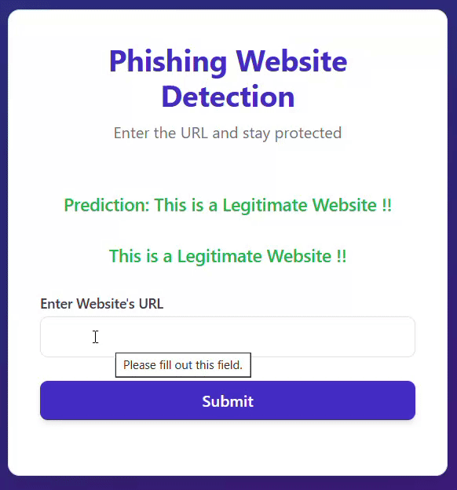

# PhishGuard
A machine learning-based system that detects phishing websites using URL features. Built with Python and Flask, trained on phishing sites URL(Kaggle) datasets.

## Demo



## Features
- Detects phishing and legitimate websites from URL input
- Trained on a large dataset of phishing and good URLs
- Uses NLP and machine learning (Logistic Regression, Naive Bayes, Random Forest, SVM)
- Interactive web interface built with Flask
- Highlights phishing results in red and legitimate results in green

## How It Works
- User enters a website URL in the web form
- The URL is cleaned and vectorized
- The trained model predicts if the site is phishing or legitimate
- The result is displayed with color-coded feedback

## Installation
1. Clone this repository:
   ```bash
   git clone https://github.com/alpha-coder21/PhishGuard.git
   cd PhishGuard
   ```
2. Create and activate a Python virtual environment:
   ```bash
   python -m venv env
   env\Scripts\activate
   ```
3. Install dependencies:
   ```bash
   pip install -r requirements.txt
   ```
4. Place the following files in the project root:
   - `model.pkl` (trained ML model)
   - `vectorizer.pkl` (CountVectorizer)
   - `mnb.pkl` (Naive Bayes model)
   - `phishing_site_urls.csv` (dataset= https://www.kaggle.com/datasets/taruntiwarihp/phishing-site-urls)

## Usage
1. Start the Flask app:
   ```bash
   python app.py
   ```
2. Open your browser and go to `http://127.0.0.1:5000/`
3. Enter a website URL to check if it is phishing or legitimate

## Example
- **Phishing URL:**
  - Input: `yeniik.com.tr/wp-admin/js/login.alibaba.com/login.jsp.php`
  - Output: `This is a Phishing Website !!` (shown in red)
- **Legitimate URL:**
  - Input: `www.youtube.com/`
  - Output: `This is a Legitimate Website !!` (shown in green)

## Project Structure
```
├── app.py
├── templates/
│   └── index.html
├── DataSet/
│   └── phishing_site_urls.csv
├── model.pkl
├── mnb.pkl
├── vectorizer.pkl
├── requirements.txt
├── README.md
└── env/
```

## Contributing
Pull requests are welcome. For major changes, please open an issue first to discuss what you would like to change.

## License
This project is for educational purposes.

